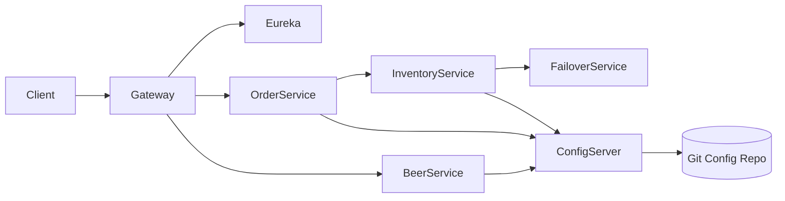

# 🍺 Brewery Microservices Platform

This repository is the **root (umbrella) project** for the *Brewery Microservices Ecosystem*.
It provides **central documentation, architecture overview, and local orchestration** for a set of Spring Boot microservices built using **Spring Cloud** patterns.

> ⚠️ This repository **does not contain business logic**.
> Each microservice lives in its own Git repository and is included here as a **Git submodule**.

---

## 🧠 System Overview

The Brewery platform is a **distributed microservices system** designed to demonstrate production-grade patterns such as:

* Service Discovery (Eureka)
* Centralized Configuration (Spring Cloud Config)
* API Gateway
* Fault tolerance and failover
* Independent deployment and scaling

All services cooperate to form a complete business domain for **beer catalog, ordering, and inventory management**.

---

## 🏗️ High-Level Architecture



---

## 📦 Included Microservices

| Service            | Repository                             | Responsibility             |
| ------------------ | -------------------------------------- | -------------------------- |
| Beer Service       | `mssc-beer-service`                    | Beer catalog management    |
| Beer Order Service | `mssc-beer-order-service`              | Order lifecycle management |
| Inventory Service  | `mssc-beer-inventory-service`          | Stock tracking             |
| Inventory Failover | `mssc-beer-inventory-failover-service` | Resilience & fallback      |
| API Gateway        | `mssc-brewery-gateway`                 | External entry point       |
| Eureka Server      | `mssc-brewery-eureka`                  | Service discovery          |
| Config Server      | `mssc-brewery-config`                  | Central configuration      |
| Config Source      | `mssc-brewery-config-source`           | Git-backed config          |
| BOM                | `mssc-brewery-bom`                     | Dependency alignment       |
| Dependencies       | `mssc-brewery-dependencies`            | Shared dependency versions |

---

## 📁 Repository Structure

```text
brewery-microservices/
├── README.md                # This file
├── services/                # Git submodules
│   ├── mssc-beer-service/
│   ├── mssc-beer-order-service/
│   ├── mssc-beer-inventory-service/
│   ├── mssc-beer-inventory-failover-service/
│   ├── mssc-brewery-gateway/
│   ├── mssc-brewery-eureka/
│   └── mssc-brewery-config/
│
├── docker-compose.yml        # Local orchestration (optional)
└── .gitmodules               # Git submodule definitions
```

---

## 🔗 Service Cooperation Model

### Communication Patterns

The Brewery platform uses **two complementary communication mechanisms**:

* **Synchronous HTTP/REST** for queries and simple request–response interactions
* **Asynchronous messaging (Message Broker)** for business events and state changes

This hybrid approach ensures **loose coupling, scalability, and resilience**.

---

### 🌐 HTTP REST Communication

HTTP REST is used mainly for:

* data retrieval (queries)
* validations and checks
* user-driven request/response flows

#### REST-based Interactions

| Caller             | Callee             | Data Exchanged             | Purpose                 |
| ------------------ | ------------------ | -------------------------- | ----------------------- |
| API Gateway        | Beer Service       | Beer DTOs                  | Fetch beer catalog      |
| API Gateway        | Beer Order Service | Order requests / responses | Create & query orders   |
| Beer Order Service | Beer Service       | Beer details               | Validate beer existence |
| Beer Order Service | Inventory Service  | Inventory availability     | Check stock levels      |

**Characteristics:**

* synchronous
* immediate response required
* used where up-to-date data is needed

---

### 📬 Asynchronous Messaging (Message Broker)

Asynchronous messaging is used for **business events** and **state propagation**.

#### Typical Events

| Event Producer     | Event                     | Event Consumer     | Purpose              |
| ------------------ | ------------------------- | ------------------ | -------------------- |
| Beer Order Service | OrderCreated              | Inventory Service  | Reserve inventory    |
| Inventory Service  | InventoryAllocated        | Beer Order Service | Confirm reservation  |
| Inventory Service  | InventoryAllocationFailed | Beer Order Service | Trigger compensation |
| Beer Order Service | OrderCancelled            | Inventory Service  | Release inventory    |

**Characteristics:**

* asynchronous
* event-driven
* no tight temporal coupling
* improves system resilience

---

### 🧠 Why This Split?

| Use Case                    | Communication Style |
| --------------------------- | ------------------- |
| Queries & reads             | HTTP REST           |
| Commands with side effects  | Messaging           |
| Cross-service state changes | Messaging           |
| User-facing requests        | HTTP REST           |

This design follows **microservices best practices**:

* REST for *queries*
* Messaging for *events and workflows*

---

### 🔄 Service Cooperation Summary

* Services **register with Eureka**
* Configuration is loaded from **Config Server**
* REST is used for synchronous queries
* Messaging is used for asynchronous workflows
* External access is routed through the **API Gateway**

This approach enables:

* loose coupling
* independent deployments
* fault isolation
* horizontal scalability

---

## 🔐 Security Model

| Layer             | Responsibility                     |
| ----------------- | ---------------------------------- |
| API Gateway       | Authentication, routing, filtering |
| Internal Services | Authorization, business rules      |

* The API Gateway is the **single entry point**
* Internal services are **not publicly exposed**
* Security can be centralized at the gateway level

---

## ▶️ How to Run the Whole System Locally

### Prerequisites

* Java 17+
* Maven 3.x
* Git

---

### Startup Order (Critical)

1. **Config Source** (Git repository – no runtime)
2. **Config Server**
3. **Eureka Server**
4. **Core Business Services**

   * Beer Service
   * Inventory Service
   * Inventory Failover Service
   * Beer Order Service
5. **API Gateway**

---

### Example Commands

```bash
cd services/mssc-brewery-config
mvn spring-boot:run

cd services/mssc-brewery-eureka
mvn spring-boot:run

cd services/mssc-beer-service
mvn spring-boot:run
```

---

## 🌍 Local Endpoints

| Component        | URL                                            |
| ---------------- | ---------------------------------------------- |
| Eureka Dashboard | [http://localhost:8761](http://localhost:8761) |
| Config Server    | [http://localhost:8888](http://localhost:8888) |
| API Gateway      | [http://localhost:9090](http://localhost:9090) |

---

## 🐳 Docker & Containers (Optional)

This repository can be extended with **Docker Compose** to start the entire platform with a single command.

```bash
docker-compose up
```

---

## 🎯 Purpose of This Repository

This root repository exists to:

* document the **system-level architecture**
* provide **onboarding instructions**
* orchestrate local development
* present the platform as a **complete microservices solution**

It is intentionally separated from business logic to maintain clean boundaries.

---

## 💼 Portfolio & Learning Value

This project demonstrates:

* real-world Spring Cloud architecture
* microservices communication patterns
* production-ready documentation mindset
* system-level thinking beyond single services

---

> 🧠 **Think in systems, not in classes.**
